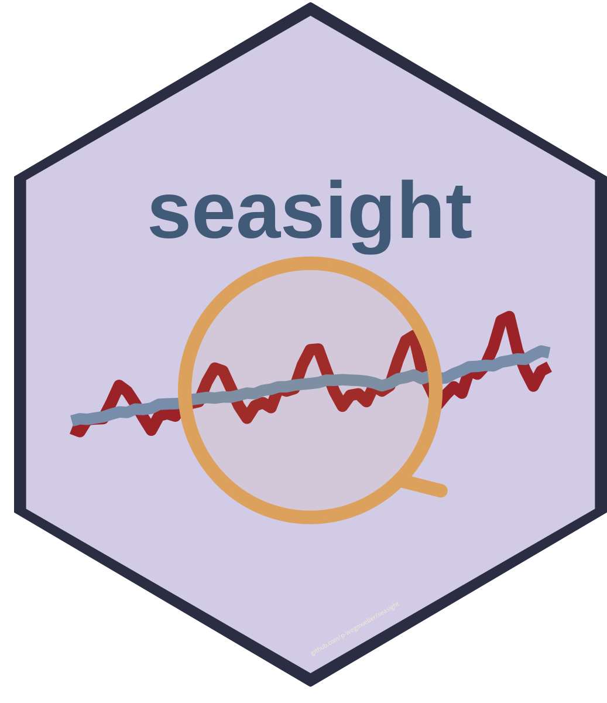

<!-- README.md is generated from README.Rmd. Please edit that file -->

`{r, include = FALSE} knitr::opts_chunk$set(   collapse = TRUE,   comment = "#>",   fig.path = "man/figures/README-",   out.width = "100%"  )`
\# seasight


<!-- badges: start -->
<!-- CRAN status badge will go here -->
<!-- GitHub Actions / R-CMD-check badge will go here -->
<!-- badges: end -->

**seasight** provides tools to *see* seasonal adjustment more clearly.  
It helps applied economists and official statisticians to run, compare
and document seasonal adjustment in a transparent and reproducible way.

The package is built on top of the
[`seasonal`](https://cran.r-project.org/package=seasonal) interface to
X-13ARIMA-SEATS and is designed for production workflows in official
statistics and central banks.

## Key features

- 🔍 **Seasonality detection & pre-checks**  
  Simple helpers to detect seasonality, trading-day and calendar
  effects, and to flag problematic series before model estimation.

- ⚙️ **Model comparison & selection**  
  Compare alternative X-13ARIMA-SEATS specifications based on a
  consistent set of diagnostics (residual tests, revision metrics,
  quality indicators).

- 📊 **Diagnostics at a glance**  
  Compact summaries, plots and tables that highlight where a seasonal
  adjustment works well – and where it does not.

- 🧾 **Reproducible reporting**  
  One-shot report generation (R Markdown / HTML) to document model
  choices, diagnostics and revision behaviour for internal review or
  dissemination.

- 🏛 **Made for official statistics**  
  Focus on transparency, stability over time and documentation of
  revisions, with use cases in national accounts and short-term
  indicators.

> **Status:** `seasight` is under active development. The user-facing
> API may still change before the first CRAN release.

## Installation

You can install the development version of reviser from
[GitHub](https://github.com/) with:

\`\`\`{r, eval = FALSE} remotes::install_github(“p-wegmueller/seasight”)
\`\`\`\`

Once the package is more mature, it is planned to be released on CRAN:

``` r
install.packages("seasight")  # not yet available
```

## Getting started

A typical workflow is:

1.  start from a raw time series,
2.  run seasonal adjustment (via `seasonal::seas()`),
3.  let **seasight** generate diagnostics and a short report.

``` r
library(seasight)
library(seasonal)

# Example series (to be adapted to your data)
x <- AirPassengers

# Basic seasonal adjustment with 'seasonal'
sa_model <- seas(x)

# Summarise diagnostics (function name subject to change)
seasight_summary(sa_model)
#> Prints a compact overview of key diagnostics

# Create an HTML report for documentation / review
seasight_report(sa_model, file = "sa_airpassengers.html")
#> Opens a browser with plots, tables and revision metrics
```

*(Function names and arguments are indicative and may change as the
package evolves. Use this as a conceptual example for now.)*

## Typical use cases

- Quarterly National Accounts: real, nominal and deflator series of
  production, expenditure and income accounts
- Short-term indicators: industrial production, retail trade, labour
  market
- Internal method reports on (re-)design of seasonal adjustment strategy
- Comparing legacy and new SA specifications during transition periods

## Contributing

Feedback from practitioners is highly welcome, especially from:

- statistical offices
- central banks and finance ministries
- researchers working with real-time data and revisions

Please feel free to open an issue or share ideas for additional
diagnostics and reports that would be useful in production.

## License

This package is released under the MIT License (see `LICENSE`).
