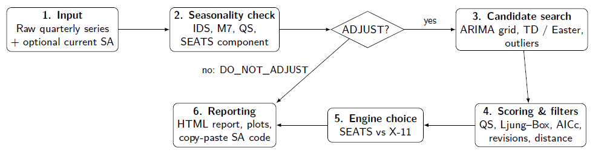

# seasight 

<!-- badges: start -->
[](https://www.repostatus.org/#active)
[](https://github.com/p-wegmueller/seasight/actions/workflows/R-CMD-check.yaml)
[](https://p-wegmueller.github.io/seasight/)
[](https://app.codecov.io/gh/p-wegmueller/seasight?branch=main)
[](https://github.com/p-wegmueller/seasight/actions/workflows/lint.yaml)
[](https://github.com/p-wegmueller/seasight/actions?query=workflow%3Apkgcheck)
[](https://lifecycle.r-lib.org/articles/stages.html#maturing)
[](LICENSE)
<!-- badges: end -->

`seasight` provides R tools for seasonal adjustment diagnostics, model comparison and reproducible HTML reporting. It builds on [`seasonal`](https://cran.r-project.org/package=seasonal) and X-13ARIMA-SEATS, with workflows aimed at official statistics, macroeconomic monitoring and production review.

`seasight` is designed for teams that need more than a one-off adjustment:
transparent diagnostics, comparable candidates, readable reports, and a
workflow that survives handover across analysts and over time.

Status: `seasight` is in a pre-submission stabilization phase. The `0.1.x`
series focuses on a stable core workflow, stronger tests, and review-ready
documentation.

## Why `seasight`

`seasight` complements rather than replaces
[`seasonal`](https://cran.r-project.org/package=seasonal).

- Use `seasonal` when you want direct manual control of a specific X-13 spec.
- Use `seasight` when you want a reviewable workflow around those specs:
  screening for apparent seasonality, generating candidate models, ranking
  them with explicit diagnostics, and producing a report that colleagues can
  inspect without reading the source code first.

This is especially useful in official statistics and macroeconomic production
workflows, where revisions, analyst turnover, and repeated model review all
matter.

## Workflow



The package supports a six-step workflow:

1. start from a raw quarterly or monthly series, with an optional current
   production adjustment;
2. check whether adjustment is warranted at all;
3. search across candidate ARIMA, trading-day, Easter, outlier, and engine
   choices;
4. score and filter candidates using diagnostics such as QS, Ljung-Box, AICc,
   revisions, and distance to the incumbent;
5. compare SEATS and X-11 when both are relevant;
6. generate a self-contained HTML report with plots, rationale, and copy-paste
   `seasonal::seas()` code.

The aim is not full automation without judgment. It is a human-in-the-loop
review workflow with explicit rules and outputs that are easy to audit,
communicate, and revisit later.

## What You Can Do

- Screen for apparent seasonality with `sa_tests_model()`,
  `sa_existence_call()`, and `sa_is_do_not_adjust()`.
- Run a bounded candidate search with `auto_seasonal_analysis()`.
- Compare the preferred model with a current production model via
  `sa_should_switch()`, `sa_compare()`, and `sa_top_candidates_table()`.
- Build reproducible HTML reports with `sa_report_html()`.
- Supply explicit trading-day and moving-holiday regressors with
  `build_user_xreg()` and `td_candidates`.

## Installation

```r
remotes::install_github("p-wegmueller/seasight")
```

## Quick Start

```r
library(seasight)
library(seasonal)

y <- AirPassengers

res <- auto_seasonal_analysis(y, max_specs = 3)

res$best
head(res$table)
res$seasonality$overall

out <- sa_report_html(
  y = y,
  max_specs = 3,
  outfile = tempfile("sa_airpassengers-", fileext = ".html")
)

out$report
```

## Compare With a Current Production Model

```r
library(seasight)
library(seasonal)

y <- AirPassengers

current_model <- seas(
  y,
  x11 = "",
  arima.model = c(0, 1, 1, 0, 1, 1),
  transform.function = "log"
)

res <- auto_seasonal_analysis(
  y = y,
  current_model = current_model,
  engine = "auto",
  max_specs = 3
)

sa_should_switch(res)

sa_report_html(
  y = y,
  current_model = current_model,
  max_specs = 3,
  outfile = tempfile("sa_airpassengers_with_baseline-", fileext = ".html")
)
```

## Decision Logic In Brief

`auto_seasonal_analysis()` may fit several X-13 models: default specifications,
optional `seasonal::fivebestmdl()` specifications, no-trading-day and
trading-day candidates, and in `engine = "auto"` mode both SEATS and X-11
attempts. Use `max_specs` for quick exploratory runs and increase the grid only
when you need a broader review.

Model ranking combines residual seasonality on the adjusted series (`QS_p`),
Ljung-Box residual diagnostics, AICc, revision metrics for the top candidates,
distance from any incumbent model, and an engine-preference penalty. The
switching helper `sa_should_switch()` is deliberately narrower: it checks the
best row against configurable thresholds for QS, Ljung-Box, distance to the
incumbent and seasonal-component correlation, returning either
`"CHANGE_TO_NEW_MODEL"` or `"KEEP_CURRENT_MODEL"`.

`sa_report_html()` writes an HTML file. In examples, use `tempfile()` or an
explicit review-output path so report generation does not unexpectedly create
files in your project root.

## Built For Review

`seasight` was designed for settings where seasonal adjustment decisions need
to be documented and explained, not just computed. The report output is meant
to support internal review, communication with subject-matter experts, and
reproducible handover across analysts.

## Try Alternative Trading-Day Regressors

`td_candidates` should be a named list of `ts` or ts-boxable regressors aligned to `y`. `seasight` does not ship broad holiday calendars; production calendar data should come from an authoritative source for the country, sector and series being adjusted. The example below is artificial but copy-pasteable.

```r
library(seasight)

y <- AirPassengers

month_length <- rep(c(31, 28, 31, 30, 31, 30, 31, 31, 30, 31, 30, 31), length.out = length(y))
td_len <- ts(month_length - mean(month_length), start = start(y), frequency = frequency(y))

td_candidates <- list(length_of_month = td_len)

res_td <- auto_seasonal_analysis(
  y = y,
  td_candidates = td_candidates,
  td_usertype = "td",
  include_easter = "auto",
  engine = "auto"
)

res_td$table[1, c("model_label", "with_td", "td_name", "td_p", "score_100")]
```

For moving-holiday pulses, use `build_user_xreg()`:

```r
diwali_dates <- as.Date(c(
  "2018-11-07", "2019-10-27", "2020-11-14", "2021-11-04",
  "2022-10-24", "2023-11-12", "2024-11-01"
))

td_holiday <- build_user_xreg(
  y = y,
  holidays = list(diwali = list(dates = diwali_dates, start = -1, end = 1)),
  td_usertype = "holiday"
)
```

## Programmatic Diagnostics

```r
library(seasight)
library(seasonal)

y <- AirPassengers
m <- seas(y)

diag_tbl <- sa_tests_model(m)
diag_tbl

sa_existence_call(diag_tbl)
extract_outliers(m)
sa_copyable_call(m, x_expr = "AirPassengers")
```

## Learn More

- Getting started: `vignettes/seasight-getting-started.Rmd`
- Advanced usage: `vignettes/seasight-advanced.Rmd`
- Seasonal adjustment in practice: `vignettes/seasight-sa-practice.Rmd`
- SEATS seasonal component absent: `vignettes/seasight-seats-absent.Rmd`

## Contributing

Feedback from practitioners is welcome, especially from statistical offices, central banks, finance ministries and researchers working with real-time macroeconomic data and revisions. Please open issues for bugs, diagnostics gaps or report improvements.

Development setup, testing expectations and review-readiness notes are described
in [`CONTRIBUTING.md`](CONTRIBUTING.md). Normal local tests do not require
tokens or external services; a GitHub token is only useful for checks that query
GitHub metadata, such as `pkgcheck`.

All participants are expected to follow the project
[Code of Conduct](CODE_OF_CONDUCT.md).

## License

This package is released under the MIT License. See `LICENSE`.
