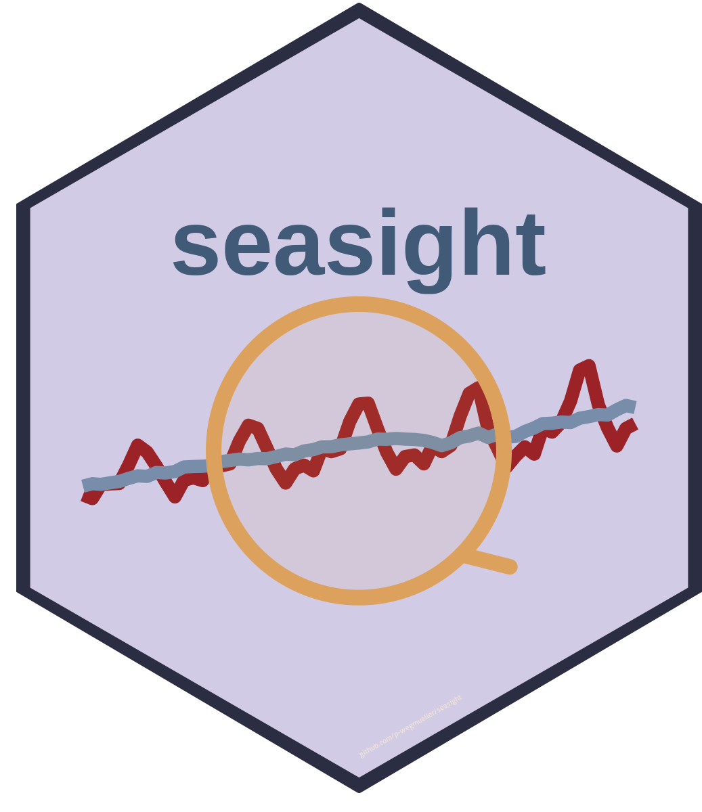

# seasight 

<!-- badges: start -->
[](https://github.com/p-wegmueller/seasight/actions/workflows/R-CMD-check.yaml)
[](https://p-wegmueller.github.io/seasight/)
[](https://lifecycle.r-lib.org/articles/stages.html#experimental)
[](LICENSE)
<!-- badges: end -->

`seasight` provides R tools for seasonal adjustment diagnostics, model comparison and reproducible HTML reporting. It builds on [`seasonal`](https://cran.r-project.org/package=seasonal) and X-13ARIMA-SEATS, with workflows aimed at official statistics, macroeconomic monitoring and production review.

## Key Features

- Seasonality diagnostics and decision rules: `sa_tests_model()`, `sa_existence_call()`, `sa_is_do_not_adjust()` and `sa_should_switch()` summarize QS, M7, IDS, Ljung-Box and switching logic.
- Automatic model grid and ranking: `auto_seasonal_analysis()` compares candidate ARIMA, trading-day, Easter and engine choices.
- Comparison and top-candidates tables: `sa_top_candidates_table()` highlights the selected model, current model and airline reference model.
- Reproducible HTML reports: `sa_report_html()` writes a self-contained report with diagnostics, plots and copy-pasteable `seasonal::seas()` calls.
- Explicit calendar regressors: `build_user_xreg()` and `td_candidates` make trading-day and moving-holiday choices auditable.

Status: `seasight` is under active development. The user-facing API may still change before the first CRAN release.

## Development workflow notes

When batching maintenance work, group related fixes together, but keep
**report/UI rendering changes** in separate batches from **core
helper/diagnostic logic** changes. This keeps reviews focused and makes
regression risk easier to assess.

For every report/UI-focused batch, include a short **manual review
checklist** describing the rendered elements to verify locally (for
example cards, plots, tables, labels, and decision pills).

## Installation

```r
remotes::install_github("p-wegmueller/seasight")
```

## Quick Start

```r
library(seasight)
library(seasonal)

y <- AirPassengers

res <- auto_seasonal_analysis(y)

res$best
head(res$table)
res$seasonality$overall

out <- sa_report_html(
  y = y,
  outfile = "sa_airpassengers.html"
)

out$report
```

## Compare With a Current Production Model

```r
library(seasight)
library(seasonal)

y <- AirPassengers

current_model <- seas(
  y,
  x11 = "",
  arima.model = c(0, 1, 1, 0, 1, 1),
  transform.function = "log"
)

res <- auto_seasonal_analysis(
  y = y,
  current_model = current_model,
  engine = "auto"
)

sa_should_switch(res)

sa_report_html(
  y = y,
  current_model = current_model,
  outfile = "sa_airpassengers_with_baseline.html"
)
```

## Try Alternative Trading-Day Regressors

`td_candidates` should be a named list of `ts` or ts-boxable regressors aligned to `y`. The example below is artificial but copy-pasteable.

```r
library(seasight)

y <- AirPassengers

month_length <- rep(c(31, 28, 31, 30, 31, 30, 31, 31, 30, 31, 30, 31), length.out = length(y))
td_len <- ts(month_length - mean(month_length), start = start(y), frequency = frequency(y))

td_candidates <- list(length_of_month = td_len)

res_td <- auto_seasonal_analysis(
  y = y,
  td_candidates = td_candidates,
  td_usertype = "td",
  include_easter = "auto",
  engine = "auto"
)

res_td$table[1, c("model_label", "with_td", "td_name", "td_p", "score_100")]
```

For moving-holiday pulses, use `build_user_xreg()`:

```r
diwali_dates <- as.Date(c(
  "2018-11-07", "2019-10-27", "2020-11-14", "2021-11-04",
  "2022-10-24", "2023-11-12", "2024-11-01"
))

td_holiday <- build_user_xreg(
  y = y,
  holidays = list(list(name = "diwali", dates = diwali_dates, start = -1, end = 1)),
  td_usertype = "holiday"
)
```

## Programmatic Diagnostics

```r
library(seasight)
library(seasonal)

y <- AirPassengers
m <- seas(y)

diag_tbl <- sa_tests_model(m)
diag_tbl

sa_existence_call(diag_tbl)
extract_outliers(m)
sa_copyable_call(m, x_expr = "AirPassengers")
```

## Documentation And Articles

- Getting started: `vignettes/seasight-getting-started.Rmd`
- Advanced usage: `vignettes/seasight-advanced.Rmd`
- Seasonal adjustment in practice: `vignettes/seasight-sa-practice.Rmd`
- SEATS seasonal component absent: `vignettes/seasight-seats-absent.Rmd`

## Local Build Checklist

Before running pkgdown or a package check locally:

1. Restart the R session to release package DLL locks.
2. Close open HTML previews, plot devices and file viewers that may hold output files.
3. Remove stale build directories only when they are generated artifacts (`docs/`, `pkgdown/`, temporary report folders).
4. Run targeted tests before broader checks.
5. For pkgdown, prefer a fresh process:

```r
devtools::load_all()
devtools::test()
pkgdown::build_site(new_process = TRUE, install = TRUE, clean = TRUE)
```

If `readRDS()` or package-locking errors appear, restart R and retry from a clean session before changing code.

## Development Workflow Notes

When batching issues, keep report/UI rendering changes separate from core helper and diagnostic logic whenever practical. For report/UI batches, include a short manual review checklist of rendered elements to inspect locally, such as cards, plots, tables, labels and decision pills.

## Contributing

Feedback from practitioners is welcome, especially from statistical offices, central banks, finance ministries and researchers working with real-time macroeconomic data and revisions. Please open issues for bugs, diagnostics gaps or report improvements.

## License

<<<<<<< Updated upstream
This package is released under the MIT License. See `LICENSE`.
=======
This package is released under the MIT License (see `LICENSE`).
>>>>>>> Stashed changes
